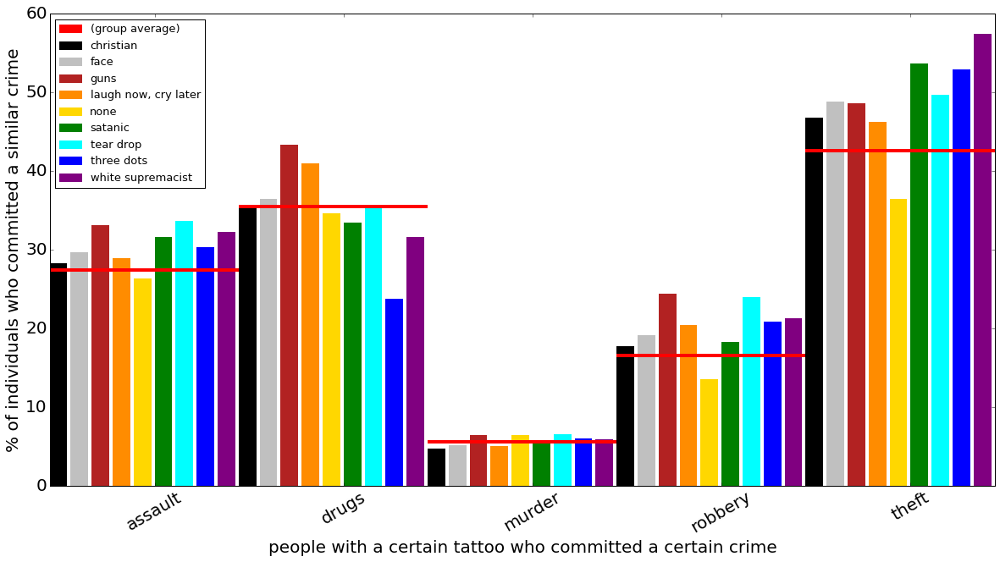
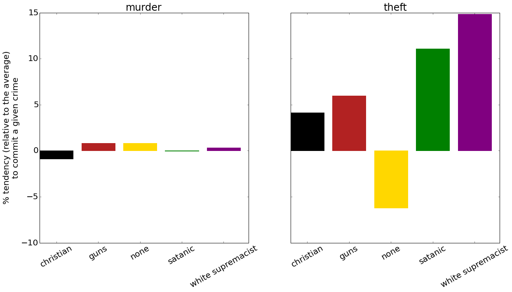

## Murder, Ink.
### A statistical analysis of tattoos in the Florida prison system

Q:
Our primary goal is to reproduce the results found in this [Economist article](http://www.economist.com/news/christmas-specials/21712032-what-can-be-learned-prisoners-tattoos-statistical-analysis-art), and to provide more access to the methods used to generate the results than the original article. To do so, we analyze data released by the [Florida Department of Corrections](http://www.dc.state.fl.us/pub/obis_request.html) to find which tattoos serve as indicators that a given inmate may have committed specific crimes.

M:
Our methods are shaped by the claims posited in the aforementioned Economist article - in particular, with looking at the correlation between crimes, types, and locations of tattoos in the Florida prison database.

To begin with, we sanitize and collate the database of inmates and convictions - tracking aliases, or multiple offenses, with the Department of Corrections ID numbers provided. We then parse through the entries in a table on scars and marks - containing information on both tattoo designs and locations - and roughly categorize the wide variety of descriptions into a more manageable number of classes: for example, adding any entries containing phrases like "CROSS", "HOLY", "ANGEL", "JESUS", or "PRAY" to our internal "Christian" category.

Similar methods - alongside a few personal judgment calls - are used to further classify specific convictions into overall trends; a variety of different convictions fit into a catch-all of "theft." Now, knowing the frequency of both crime types and tattoo varieties in the Florida inmate population, we can compare the relative frequencies of crime-tattoo pairings relative to the population at-large. Such comparisons are further extendable to the recorded locations of tattoos (e.g., "HEAD," "RIGHT ARM"), allowing us to generate our final results.

To see the entirety of our methods, our source code can be found [here](../code/report1.ipynb).

R:
The Economist’s results were presented almost entirely as relative frequencies, without a great deal of context. Their graphic shows that inmates with tattoos were "less likely" to have committed murder, but it is not by how much. We discovered that comparing the percentage of people with a specific tattoo to the percentage of people without that class of tattoo closely matched the Economist results.

Our source notebook contains statistics for a larger number of tattoos and crime categories than are depicted here; this chart is emblematic of the types of comparisons which we perform. We also looked more closely at a certain number of tattoo and crime categories, specifically focusing on their differences from the average.

Here, we can further see how inmates with different styles of tattoo deviate from the norm, and by varying amounts. Murder, as a whole was barely affected by tattoo choice, making it common ground for all sorts of groups; theft, on the other hand, strayed much further from the average, with  wildly varying rates based on the tattoo type (or, in fact, having any tattoos at all).

The article additionally noted that people with tattoos on their faces or necks are, perhaps surprisingly, comparatively less likely to have committed murder. This is consistent with our own analysis, which found that, while 15.3% of active inmates without such tattoos had murder convictions, only 11.2% of those with such "visible" tattoos were in prison on similar charges - a nearly 37% gap.

I:
These results, matching numerous categories to crimes, are difficult to summarize in full; however, several noteworthy relationships stand out. For example, in figure [TODO], we can see the relatively greater share of murders committed by people without tattoos, when compared with inmates with Christian or otherwise religious body art. This pattern, meanwhile, is reversed in the case of theft. Although the exact relationship is difficult to determine - especially because we do not know the dates of arrests, crimes, or tattoos - it nonetheless seems reasonable to suspect that many murderers are "atypical" criminals--people who struck out in a moment of rage or passion; contemporary religious attitudes towards forgiveness and extreme conduct, furthermore, might well justify the overrepresentation of Christian symbolism amongst non-violent thieves.

In most regards, our results concur with those presented by the Economist - save for a few small differences, likely attributable to our methods of categorization. For example, the article notes that people with "three dots" tattoos are significantly more likely to have committed murder; our own results, meanwhile, suggest only a slight overrepresentation. The article, furthermore, states that there is a roughly 30% gap between murderers with and without head or neck tattoos; this also differs from our results, though again only by degrees.

Potential risks to this study include the potential for overfitting. The numerous tattoos and crimes, coupled with the size disparity between categories (e.g., some 138,000 Christian tattoos, to just over 4,000 "Laugh Now, Cry Later" ones), could show us trends where none truly exist.

Additionally, our classification of tattoos based on Department of Corrections descriptions could cause our results to differ slightly from others’ findings. For example, our definitions of "Christian" tattoos might include some descriptors which were absent in the original article, or lump other faiths in through its inclusion of "PRAY"; one more familiar with the matter might, furthermore, draw a different line between "Christian" and "Satanic" ink than we did.
